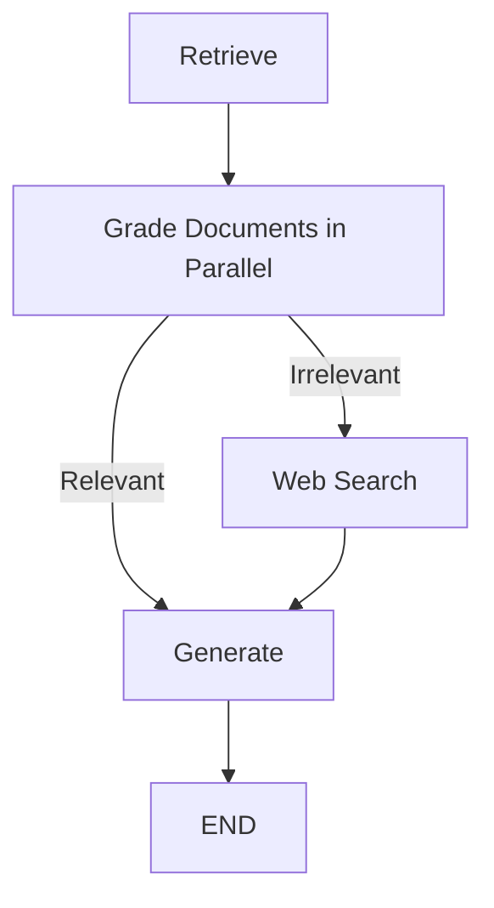

# Corrective Retrieval-Augmented Generation (C-RAG)

🚀 **C-RAG** is an implementation of the *Corrective Retrieval-Augmented Generation* (C-RAG) workflow, inspired by the paper [Corrective Retrieval Augmented Generation (2024)](https://arxiv.org/pdf/2401.15884).  
It intelligently **retrieves**, **grades**, and **generates** high-quality answers by correcting irrelevant retrieved information via web search if necessary.

---

## 📚 Table of Contents

- [About the Project](#about-the-project)
- [Key Features](#key-features)
- [Architecture](#architecture)
- [Technologies Used](#technologies-used)
- [Installation](#installation)
- [Usage](#usage)
  - [Web Interface (Gradio)](#web-interface-gradio)
  - [CLI Interface](#cli-interface)
  - [LangGraph Studio](#langgraph-studio)
- [Data Ingestion](#data-ingestion)
- [Embedding Cache](#embedding-cache)
- [Parallel Document Grading](#parallel-document-grading)
- [Project Structure](#project-structure)
- [Configuration](#configuration)
- [Future Work](#future-work)
- [Acknowledgements](#acknowledgements)

---

## 📖 About the Project

Traditional Retrieval-Augmented Generation (RAG) systems sometimes retrieve **irrelevant documents**, leading to poor generation quality.

**C-RAG** enhances this process by:
- **Grading** retrieved documents for relevance
- **Performing web search** if necessary to correct irrelevant retrievals
- **Generating** a final answer based on the corrected knowledge base
- **Caching embeddings** to reduce API calls and improve performance
- **Parallel processing** for faster document grading

---

## ✨ Key Features

- ✅ **Intelligent Document Grading** - Binary relevance scoring with parallel processing
- ✅ **Corrective Web Search** - Fallback to web search for irrelevant docs
- ✅ **Embedding Cache** - Persistent caching using `CacheBackedEmbeddings`
- ✅ **Modular Architecture** - Separate ingestion and retrieval modules
- ✅ **Vector Store** - ChromaDB for efficient document storage
- ✅ **Parallel Grading** - 4x faster document evaluation
- ✅ **Web UI** - Beautiful Gradio interface
- ✅ **Multi-LLM Support** - OpenAI, Google Gemini, and Groq

---

## 🧠 Architecture

The project builds a **graph workflow** consisting of the following nodes:

- **Retrieve** → Fetch documents from a vector database (ChromaDB)
- **Grade Documents** → Grade each document for relevance (binary yes/no) **in parallel**
- **Decision** → If documents are irrelevant, trigger **Web Search**; else directly **Generate**
- **Web Search** → Perform search using **Tavily API** for updated documents
- **Generate** → Generate a final response using the most relevant documents



🖼️ See `graph.png` for the auto-generated workflow diagram

---

## ⚙️ Technologies Used

### Core Stack
- **Python 3.13+**
- **LangChain Classic** - Embedding caching support
- **LangChain Community** - Document loaders, vector stores
- **LangGraph** - Workflow orchestration
- **ChromaDB** - Vector database
- **Gradio 6.1+** - Web interface
- **UV Package Manager** - Fast Python package management

### AI Models
- **OpenAI Embeddings** - With caching for cost efficiency
- **Groq Llama 3.3 70B** - Text generation (fast and free)
- **Groq Llama 3.1 8B** - Document grading (fast and free)
- **Tavily Search API** - Fallback web search

---

## 🔥 Installation

### 1. Clone the Repository

```bash
git clone https://github.com/RAHULREDDYYSR/C_RAG.git
cd C_RAG
```

### 2. Install Dependencies

This project uses **UV** for fast package management:

```bash
uv sync
```

Or with pip:

```bash
pip install -r requirements.txt
```

### 3. Environment Variables

Create a `.env` file with your API keys:

```env
OPENAI_API_KEY=your-openai-api-key
TAVILY_API_KEY=your-tavily-api-key
GOOGLE_API_KEY=your-google-api-key
GROQ_API_KEY=your-groq-api-key
```

### 4. Run Data Ingestion (First Time Only)

Before running the application, ingest data into ChromaDB:

```bash
uv run python ingestion.py
```

This will:
- Load documents from configured URLs
- Split them into chunks
- Generate and **cache** embeddings
- Store vectors in `./.chroma` directory
- Cache embeddings in `./.cache/embeddings`

> 💡 **Note**: Ingestion only needs to be run once. The embeddings cache persists, so re-running ingestion (after deleting `.chroma`) will reuse cached embeddings instead of calling OpenAI API again!

---

## 🚀 Usage

### Web Interface (Gradio)

**Launch the Gradio web app:**

```bash
uv run python app.py
```

The browser will **automatically open** to `http://localhost:7860`

**Features:**
- 🎨 Beautiful gradient UI
- 📝 Question input with auto-focus
- 🤖 AI-generated answers with sources
- 📊 Workflow transparency (optional)
- 💡 Pre-loaded example questions

### CLI Interface

**Run from command line:**

```bash
uv run python main.py
```

Edit `main.py` to change the question.

### LangGraph Studio

**Launch LangGraph dev server:**

```bash
langgraph dev
```

Access at:
- 🚀 API: `http://127.0.0.1:2024`
- 🎨 Studio: `https://smith.langchain.com/studio/?baseUrl=http://127.0.0.1:2024`
- 📚 Docs: `http://127.0.0.1:2024/docs`

---

## 📥 Data Ingestion

Ingestion is **separated** from the main application for better modularity.

### Adding New Documents

1. Edit `urls` list in `ingestion.py`
2. Delete the `.chroma` directory (cache remains intact):
   ```bash
   rm -rf .chroma  # Linux/Mac
   Remove-Item -Recurse -Force .chroma  # Windows
   ```
3. Re-run ingestion:
   ```bash
   uv run python ingestion.py
   ```

Only **new** URLs will call OpenAI API - existing ones use cache! ✅

---

## 💾 Embedding Cache

This project implements **persistent embedding caching** to optimize performance and reduce costs.

### How It Works

- **First Run**: Embeddings are generated via OpenAI API and cached locally
- **Cache Storage**: Stored in `./.cache/embeddings/` directory  
- **Subsequent Runs**: If you delete `.chroma` and re-run ingestion, cached embeddings are reused (no API calls!)
- **Query Caching**: New queries also benefit from caching

### Benefits

- ✅ **Cost Savings** - Avoid redundant OpenAI API calls
- ✅ **Faster Performance** - Instant embedding retrieval from local cache
- ✅ **Persistent** - Cache survives across runs
- ✅ **Automatic** - No manual cache management needed

### Managing the Cache

**View cache statistics:**
```bash
# Windows
Get-ChildItem -Path .\.cache\embeddings -Recurse | Measure-Object

# Linux/Mac
find ./.cache/embeddings -type f | wc -l
```

**Clear cache if needed:**
```bash
# Windows
Remove-Item -Recurse -Force .cache

# Linux/Mac
rm -rf .cache
```

---

## ⚡ Parallel Document Grading

The system uses **parallel processing** to grade all retrieved documents simultaneously, resulting in **4x faster** grading.

### Performance Comparison

| Metric | Before (Sequential) | After (Parallel) | Improvement |
|--------|-------------------|-----------------|-------------|
| **4 documents** | ~4-5 seconds | ~1-2 seconds | **4x faster** ✨ |
| **10 documents** | ~10-12 seconds | ~1-2 seconds | **10x faster** 🚀 |

### How It Works

```python
# All documents graded simultaneously using asyncio
async def grade_all():
    tasks = [grade_single_document(question, doc) for doc in documents]
    return await asyncio.gather(*tasks)  # Parallel execution
```

### Benefits

- ✅ **4x Faster Grading** - All documents graded simultaneously
- ✅ **Better User Experience** - Faster response times
- ✅ **Scalable** - Handles more documents efficiently
- ✅ **API Efficient** - Makes concurrent API calls within rate limits

---

## 🗂️ Project Structure

```
C_RAG/
 ├── graph/
 │    ├── chains/
 │    │    ├── generation.py        # LLM chain for generation (Groq Llama 3.3 70B)
 │    │    └── retrieval_grader.py   # Grading chain (Groq Llama 3.1 8B)
 │    ├── nodes/
 │    │    ├── generate.py           # Generation node
 │    │    ├── grade_documents.py    # Parallel document grading node
 │    │    ├── retrieve.py           # Retrieval node
 │    │    └── web_search.py         # Web search node
 │    ├── consts.py                  # Node name constants
 │    ├── state.py                   # Graph state structure
 │    └── graph.py                   # Graph workflow setup
 ├── ingestion.py                    # 📥 Standalone data ingestion script
 ├── retriever.py                    # 🔍 Retriever with cached embeddings
 ├── app.py                          # 🌐 Gradio web interface
 ├── main.py                         # 💻 CLI entry point
 ├── benchmark.py                    # 📊 Performance benchmarking
 ├── .env                            # 🔐 Environment variables (not committed)
 ├── .cache/                         # 💾 Cached embeddings (auto-generated)
 ├── .chroma/                        # 📦 Vector store (auto-generated)
 ├── pyproject.toml                  # 📦 Python dependencies (UV)
 ├── langgraph.json                  # ⚙️ LangGraph configuration
 └── graph.png                       # 🖼️ Workflow visualization
```

### Key Files

- **`ingestion.py`** - Run independently to load/update data. Creates vector store and caches embeddings.
- **`retriever.py`** - Loads existing vector store with cached embeddings. Used by the application.
- **`app.py`** - Gradio web interface with auto-launch in browser.
- **`main.py`** - CLI entry point that uses the retriever.

> 💡 **Workflow**: Run `ingestion.py` first (only when adding/updating data), then run `app.py` or `langgraph dev`.

---

## ⚙️ Configuration

### Switching LLM Models

Edit the model configuration in:
- **Generation**: `graph/chains/generation.py`
- **Grading**: `graph/chains/retrieval_grader.py`

**Available options:**
```python
# OpenAI
llm = ChatOpenAI(model="gpt-4o-mini")

# Google Gemini
llm = ChatGoogleGenerativeAI(model="gemini-2.0-flash")

# Groq (Fast & Free)
llm = ChatGroq(model="llama-3.3-70b-versatile")  # Generation
llm = ChatGroq(model="llama-3.1-8b-instant")     # Grading
```

### Gradio App Settings

Edit `app.py` to customize:
```python
demo.launch(
    server_name="0.0.0.0",      # Change to "127.0.0.1" for localhost only
    server_port=7860,            # Change port if needed
    share=False,                 # Set True for public sharing
    inbrowser=True               # Auto-open browser
)
```

---

## 🚀 Future Work

- [ ] Add chat history and conversation memory
- [ ] Support document upload via UI
- [ ] Add feedback buttons for answers
- [ ] Export answers to PDF
- [ ] Add dark mode toggle
- [ ] Multi-hop retrieval and reasoning
- [ ] Reranking models for better document ordering
- [ ] Streaming responses

---

## 🙏 Acknowledgements

- [Corrective Retrieval-Augmented Generation (Paper, 2024)](https://arxiv.org/pdf/2401.15884)
- [LangChain](https://www.langchain.dev/)
- [LangGraph](https://github.com/langchain-ai/langgraph)
- [Chroma](https://docs.trychroma.com/)
- [Tavily Search API](https://www.tavily.com/)
- [Gradio](https://www.gradio.app/)
- [Groq](https://groq.com/)

---

## ✨ Author

- **Rahul Y S** — [@RAHULREDDYYSR](https://github.com/RAHULREDDYYSR)

---

> ⭐ If you find this project useful, consider giving it a star on GitHub!
